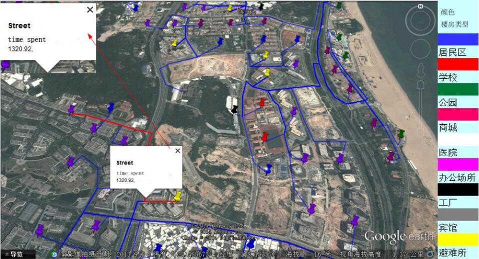

<h4>Research of Personnel Evacuation in Tsunami</h4>

 
    
 
Young Teacher Foundation of Ocean University of China &mdash; undergraduate graduation design 
2 monthes, March 2014 &mdash; May 2014

    The project is based on the tsunami simulation data generated by the Numerical model of COMCOT and high resolution remote sensing maps obtained by remote sensing satellites; We extracted road network from the map by MapInfo tools, solved the shortest path for crowd evacuation by Dijkstra algorithm, and finally established a tsunami personnel evacuation plan.

Project on Github:
<a href="https://github.com/zxwedu/GraduDesign" target="_blank">GraduDesign</a>
 
 
    The Related Paper: <a href="./download/Tsunami.pdf" target="_blank">Visual Simulation for Tsunami and Disaster Risk Assessment</a>
    

