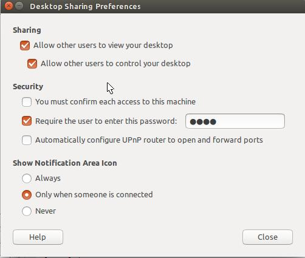

Windows（xrdp+vnc）远程连接Ubuntu系统

一般情况下，很多服务器会安装ubuntu系统，而个人电脑常安装windows系统。那么，在windows系统中，如何通过远程桌面连接软件，远程连接ubuntu系统呢？具体可以参考以下步骤：

<b>（1）Ubuntu系统设置：安装xrdp，vnc4server</b>

安装xrdp：sudo apt-get install xrdp

安装vnc4server：sudo apt-get install vnc4server

<b>（2）Ubuntu设置允许远程连接和控制</b>

具体参考下图：

<b>（3）设置xrdp </b>

echo "gnome-session --session=gnome-classic" > ~/.xsession

该命令的作用是由于安装了gnome桌面，ubuntu12.04中同时存在unity、GNOME多个桌面管理器，需要启动的时候指定一个，不然即使远程登录验证成功以后，也只是背景。

<b>（4）重启 xrdp</b>

通过执行命令重启xrdp: sudo /etc/init.d/xrdp restart 

<b>（5）可能遇到的问题</b>

<b>A.连接错误</b>

started connecting

connecting to 127.0.0.1 5900

tcp connected

security level is 0 (1 = none, 2 = standard)

error - problem connecting

运行以下命令，并重启计算机：gsettings set org.gnome.Vino require-encryption false

<b>B.解决问题A时，出现的新错误</b>

在执行命令gsettings set org.gnome.Vino require-encryption false 之后，出现了如下的错误：

GLib-GIO-Message: Using the 'memory' GSettings backend. Your settings will not be saved or shared with other applications.

该错误的解决办法如下：

在终端中输入命令：export GIO_EXTRA_MODULES=/usr/lib/x86_64-linux-gnu/gio/modules/，然后执行gsettings set org.gnome.Vino require-encryption false，问题得到解决。

Tips：将命令export GIO_EXTRA_MODULES=/usr/lib/x86_64-linux-gnu/gio/modules/直接粘贴到.bashrc文件中，也可以解决问题B。但要记得粘贴到.bashrc文件中后，需要执行命令source .bashrc，使得export的命令生效。

 
 
参考自以下连接：

      
<a href="http://www.linuxidc.com/Linux/2015-05/117835.htm">
	  http://www.linuxidc.com/Linux/2015-05/117835.htm</a>

	  
<a href="http://blog.sina.com.cn/s/blog_6bc0bae70100zegr.html">
	  http://blog.sina.com.cn/s/blog_6bc0bae70100zegr.html</a>

	  
<a href="http://ubuntuforums.org/showthread.php?t=2230453">
    http://ubuntuforums.org/showthread.php?t=2230453</a>

    
<a href="http://www.cnblogs.com/kehaimin/p/8622592.html">
      http://www.cnblogs.com/kehaimin/p/8622592.html</a>
