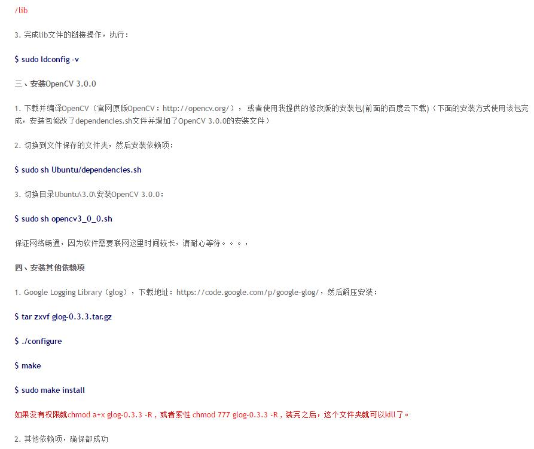
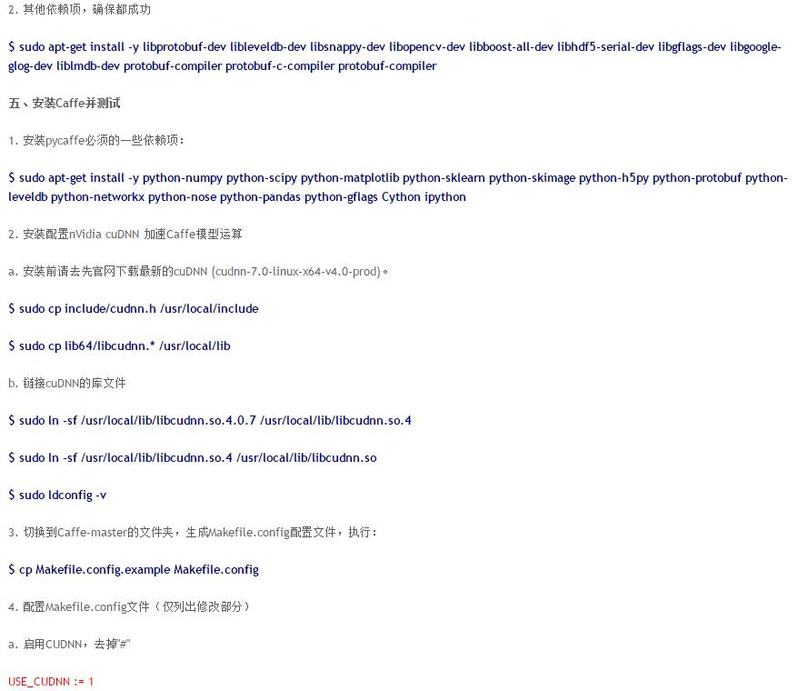
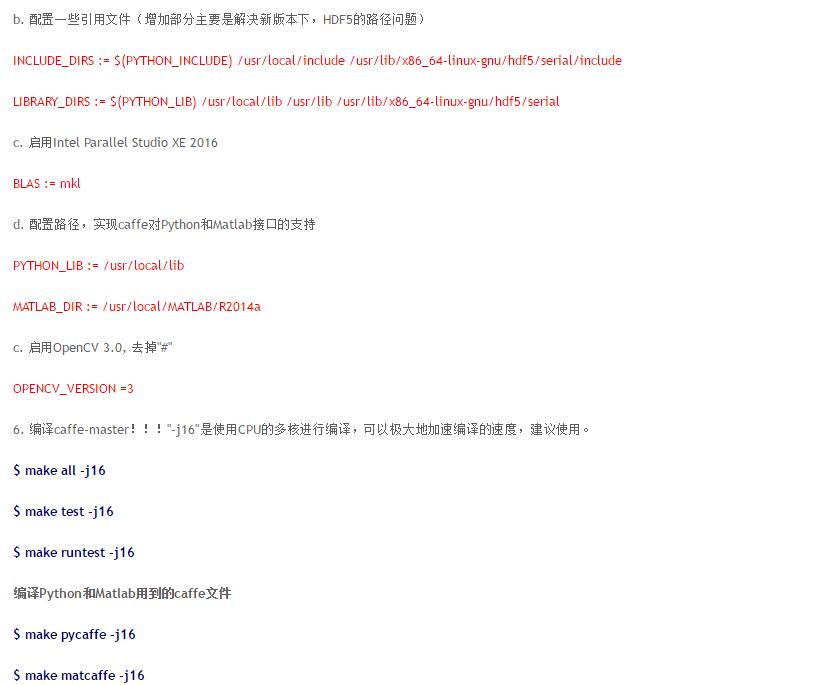

【转载】Caffe + Ubuntu 15.04 + CUDA 7.5 新手安装配置指南

为了方便地找到欧新宇老师配置caffe的博客，故转载欧老师的博客到自己的博客下。感谢欧老师的辛勤工作。

参考自以下连接：

      
<a href="http://ouxinyu.github.io/Blogs/20151108001.html">
	  Caffe + Ubuntu 15.04 + CUDA 7.5 新手安装配置指南</a>

	  

<b>（1）nVidia CUDA Toolkit的安装（*.deb方法）</b>

一、CUDA Repository 
获取CUDA安装包,安装包请自行去NVidia官网下载。（https://developer.nvidia.com/cuda-downloads） 
$ sudo dpkg -i cuda-repo-ubuntu1504-7-5-local_7.5-18_amd64 
$ sudo apt-get update 
二、CUDA Toolkit 
$ sudo apt-get install -y cuda

<b>（2）Caffe-Master的安装和测试</b>

具体参考下图：

本文只截取了部分安装过程，更具体的操作，请参考欧老师的博客。<a href="http://ouxinyu.github.io/Blogs/20151108001.html">
	  Caffe + Ubuntu 15.04 + CUDA 7.5 新手安装配置指南</a>

	  

<b> caffe安装个人心得：</b>

	
1、ubuntu14.04.3系统，安装cuda7.5可以正常使用。但是连接KVM的话，使用cuda7.5的驱动，分辨率会不正常。

	
2、连接kvm的nvidia显卡驱动版本为352.63时，分辨率正常。

	
3、ubuntu 14.04.1系统，配合cuda7.0和cudnnV4，caffe可以正常使用。而且安装的显卡驱动版本也为352.63，kvm也可正常使用。

	
4、安装caffe下的所有软件，一定要在全英文的路径下，路径中不要包含中文，特别是安装opencv的时候。

	
5、实践证明的可使用组合：
	 硬件：titanX显卡，无单独显卡；Intel core i5-4590CPU，4核；32G内存；
	 ubuntu系统14.04.1，64位操作系统
	 cuda7.0；cudnnV4；opencv3.1.0；parallel studio 2013；google golg-0.3.3；MATLAB 2014b
	

