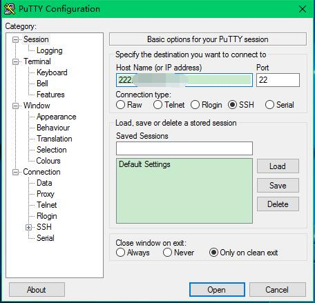
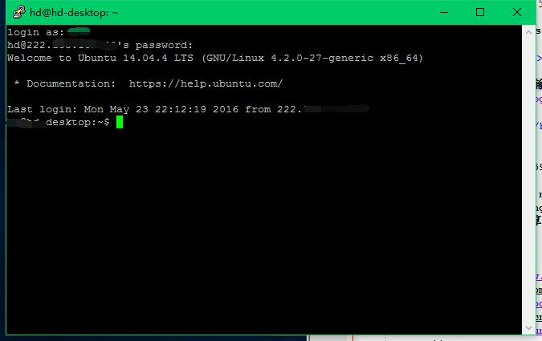

ubuntu下配置ssh，与windows进行文件传输

一直以来，远程连接windows都是使用vnc（配置方法参见：<a href="http://zhouxiaowei1120.github.io/Blogs/20160407.html">Windows（xrdp+vnc）远程连接Ubuntu系统</a>）。windows下使用vnc连接ubuntu，可以看到图形界面,操作比较友好，但是速度比较慢。而使用ssh的好处是速度比较快，同时可以通过安装软件传输文件。一旦系统崩溃，在系统无法进入桌面和tty的情况下，可以通过ssh远程连接进行操作。

<b>（1）Ubuntu系统设置：安装ssh</b>

安装ssh：sudo apt-get install openssh-server

<b>（2）windows下设置，可以远程连接ubuntu</b>

下载putty，按照下图方式输入ip、端口等，可以直接通过命令行连接远程连接到ubuntu服务器。

然后按照下图输入用户名密码等，即可登录到home下。

<b>（3）windows下设置，可以远程连接ubuntu并且可以传输文件</b>

A.先安装xshell，可以远程连接ubuntu。连接方法同（2）

B-1.再安装xftp，即可远程传输文件到ubuntu。

B-2.直接安装winscp，也可以远程传输文件。

