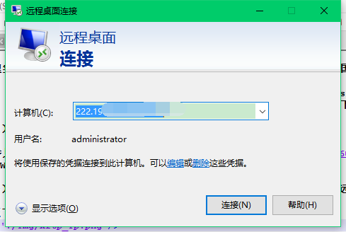
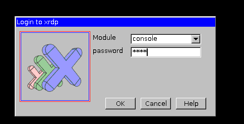
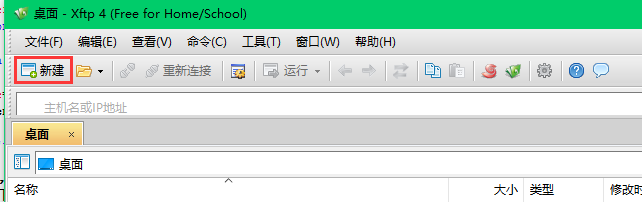
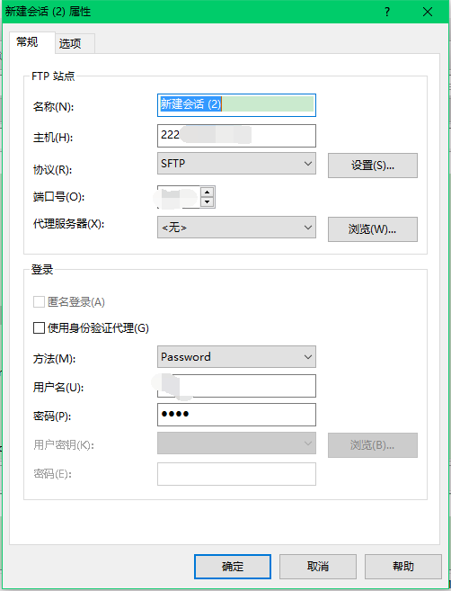

Windows远程连接Ubuntu，上传文件并运行matlab

在管理实验室（<a href="http://cvpr.ouc.edu.cn" target="_blank">中国海洋大学视觉实验室
            </a>）服务器的过程中，经常有同学会找管理员询问如何在Windows系统下，远程连接Ubuntu系统，上传文件至服务器，并运行matlab代码。现将步骤总结如下：

<b>（1）配置系统，使得Windows系统可以远程连接Ubuntu系统</b>

具体参见博客：<a href="http://zhouxiaowei1120.github.io/Blogs/20160407.html" target="_blank">Windows（xrdp+vnc）远程连接Ubuntu系统</a>

<b>（2）通过windows系统“远程桌面连接”软件，连接Ubuntu系统，即可远程控制Ubuntu</b>

A.按照下图，输入ip，远程连接系统。

B.选择console模式，输入步骤（1）中设置的密码。

<b>（3）配置SSH，使得Windows可以与Ubuntu系统远程传输文件</b>

具体参见：<a href="http://zhouxiaowei1120.github.io/Blogs/20160524.html" target="_blank">ubuntu下配置ssh，与windows进行文件传输</a>

按照上述步骤安装好软件之后，具体上传文件过程如下：以xftp软件为例。

A.按照下图方式新建传输对话框。

B.按照下图方式，输入ip、端口、协议、用户名、密码等，选择“确定”按钮后，即可连接到Ubuntu系统home文件夹。。

C.选择待传输的文件，上传到服务器，或者从服务器下载。

PS：再告诉大家一个命令，如何打开matlab：在ubuntu系统下，打开命令终端（ctrl+alt+t）; 然后输入命令sudo ./matlab 或者 sudo /usr/local/Matlab/R2014b/bin/./matlab，即可打开matlab。注意，我的matlab是2014b版本的呦！

现在一切终于已经搞定了，就等你开始运行程序了。（心好累~~~

